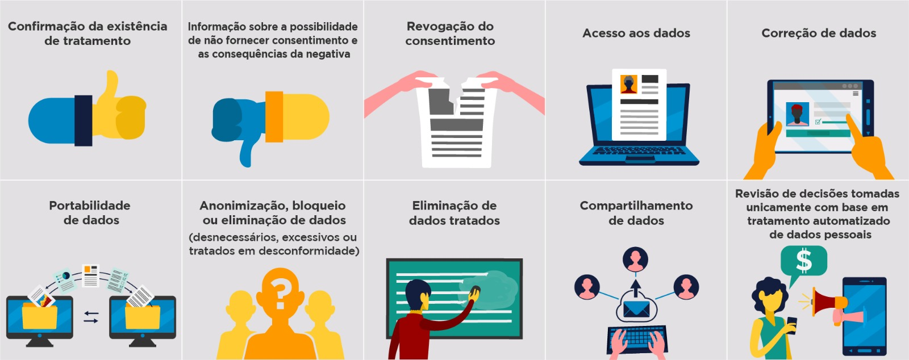

# Curso LGPD

# LGPD

A Lei Geral de Proteção de Dados Pessoais (LGPD) tem por objetivo **proteger os dados pessoais** preservando a privacidade das pessoas, ao determinar às organizações diretrizes para o tratamento de dados pessoais dos indivíduos, evitando práticas abusivas e criminosas. Sendo assim, a LGPD **não tem o intuito de engessar o desenvolvimento tecnológico e econômico**, mas sim regulamentar o tratamento dos dados para que sejam utilizados de forma ética e responsável.

## Dados pessoais e dados pessoais sensíveis
- Dados pessoais 
     - São aqueles que se traduzem em informação relacionada à pessoa natural (ou física) identificada ou identificável, permitindo ou não a individualização do titular, direta ou indiretamente, por meio dos dados
     utilizados.
    Exemplos: nome, nome dos pais, RG, CPF, número da carteira de habilitação etc.
 

- Dados sensíveis
    - Dados pessoais sensíveis
    São dados pessoais que podem trazer um perigo maior relacionado a situações de preconceito ou de segurança às pessoas.
    Exemplos: origem étnica, convicção religiosa, opinião política, filiação a sindicato, dados referentes à saúde ou à vida sexual, dado genético ou biométrico, entre outros.

 

## Coleta de dados
**Como ocorre?**
- A coleta de dados é realizada por meio dos formulários e cadastros, físicos ou eletrônicos, que preenchemos com nossos dados pessoais para contratação de serviços, por exemplo.

### Privacidade

Você já deve ter recebido telefonemas ou mensagens de várias organizações, oferecendo produtos ou serviços, mesmo não tendo nenhum vínculo ou passado alguma informação para essa empresa, certo?  Isso ocorre porque suas informações foram compartilhadas com outras empresas, sem o seu consentimento. 

A coleta e a utilização de dados são importantes e necessárias às atividades das organizações. No entanto, a partir de agora, há uma legislação específica, visando a proteção de dados, que determina às organizações diretrizes para a coleta e o uso de dados pessoais dos indivíduos.

Situações como a coleta e o compartilhamento de dados sem a ciência e o consentimento do titular dos dados, não são mais permitidas pela LGPD.

A privacidade, além de direito assegurado, é também pilar fundamental para o equilíbrio nas relações humanas, de forma que o indivíduo contribua na sua essência para a construção de um mundo melhor, de forma livre e conforme suas convicções.

>  _**Pegadas digitais** é um termo que remete ao histórico de dados e informações que inserimos na internet e nunca mais serão removidos, como, por exemplo, uma fotografia._

 

## Direito assegurado

Por tratamento de dados, a lei dispõe a seguinte informação:

> _**Toda operação realizada com dados pessoais**, como coleta, produção, recepção, classificação, utilização, acesso, reprodução, transmissão, distribuição, processamento, arquivamento, armazenamento, eliminação, avaliação ou controle da informação, modificação, comunicação, transferência, difusão ou extração._

## Direito dos indivíduos

 

### Confirmação da existência de tratamento

> [!NOTE]
>**Exigir o conhecimento e a confirmação sobre** a existência de um possível **tratamento dos seus dados**.

Esse conhecimento refere-se à nossa análise quanto ao uso dos dados que fornecemos antes de decidir comprar um produto, contratar um serviço ou até mesmo navegar por um site. É necessário que o comprador tenha a preocupação com a privacidade dos seus dados, principalmente em relação ao tratamento que será realizado. **Exigir esse conhecimento é o primeiro dos seus direitos assegurados pela Lei**.

> [!CAUTION]
> A confirmação de existência de tratamento ou o acesso aos dados pessoais deve ser providenciada mediante requisição do titular em formato simplificado e imediatamente ou por meio de declaração clara e completa, fornecida no prazo de até 15 (quinze) dias, contado da data do requerimento do titular, indicando a origem dos dados, a inexistência de registro, os critérios utilizados e a finalidade do tratamento, observados os segredos comercial e industrial.

 

### Possibilidade de não fornecer consentimento
> [!NOTE]
> Ao conhecer o tratamento que a organização realizará em seus dados, é muito importante que você o avalie. A lei permite, em alguns casos, que você decida se deseja ou não autorizar determinado tratamento e que você mude de ideia sempre que quiser.

Considere um diferencial se a organização lhe fornecer explicações sobre o tratamento ou eventuais benefícios que você terá em fornecer suas informações.

No caso de cumprimento de obrigação legal, interesses legítimos de uso dos nossos dados por parte do Governo ou exercício regular de direito da organização, **não poderemos nos opor a esse tratamento**.

Para todos os outros casos, o tratamento das informações pode ser questionado a qualquer momento e **a Lei permite a prerrogativa de nos opormos ao dado tratamento**, caso o consideremos incompatível com nossos interesses pessoais.

Ter a liberdade de permitir ou não o tratamento dos seus dados, é mais um **direito garantido** pela LGPD.

> [!CAUTION]
> A organização deve sempre oferecer a opção do não consentimento. Clareza e transparência no tratamento dos dados pessoais são características que selecionam e fortalecem o posicionamento das boas organizações no mercado.

 

### Revogação do consentimento

> [!NOTE]
>No caso de o tratamento lhe parecer incompatível com o que foi apresentado ou a organização não esclarecer o uso que fará de seus dados, a LGPD lhe permite a **revogação**, que é o arrependimento do consentimento emitido incialmente.

Imagine que um cliente consentiu que uma empresa fizesse o armazenamento de seus dados pessoais, mas não consentisse que ela os compartilhasse com outras organizações. **Caso a empresa faça esse compartilhamento, ela estará violando o acordo** que firmou com o titular das informações.

Nesse caso, o cliente tem o direito de solicitar à concessionária a **revogação do consentimento** para armazenar seus dados.

**Esse arrependimento na revogação** total ou parcial do tratamento **só é possível se a lei permitir**, pois alguns dados fazem parte das estratégias de gestão do Governo, além de poderem ser utilizados por entidades privadas para cumprimento de obrigação legal ou exercício regular de direito, independentemente da vontade do titular.

 

