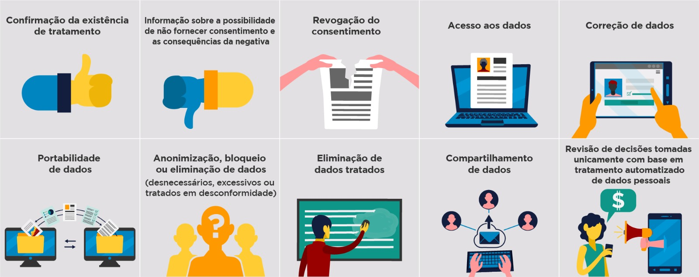

# Direito assegurado

Por tratamento de dados, a lei dispõe a seguinte informação:

> _**Toda operação realizada com dados pessoais**, como coleta, produção, recepção, classificação, utilização, acesso, reprodução, transmissão, distribuição, processamento, arquivamento, armazenamento, eliminação, avaliação ou controle da informação, modificação, comunicação, transferência, difusão ou extração._

# Direito dos indivíduos

 

## Confirmação da existência de tratamento

> [!NOTE]
>**Exigir o conhecimento e a confirmação sobre** a existência de um possível **tratamento dos seus dados**.

Esse conhecimento refere-se à nossa análise quanto ao uso dos dados que fornecemos antes de decidir comprar um produto, contratar um serviço ou até mesmo navegar por um site. É necessário que o comprador tenha a preocupação com a privacidade dos seus dados, principalmente em relação ao tratamento que será realizado. **Exigir esse conhecimento é o primeiro dos seus direitos assegurados pela Lei**.

> [!CAUTION]
> A confirmação de existência de tratamento ou o acesso aos dados pessoais deve ser providenciada mediante requisição do titular em formato simplificado e imediatamente ou por meio de declaração clara e completa, fornecida no prazo de até 15 (quinze) dias, contado da data do requerimento do titular, indicando a origem dos dados, a inexistência de registro, os critérios utilizados e a finalidade do tratamento, observados os segredos comercial e industrial.

 

## Possibilidade de não fornecer consentimento
> [!NOTE]
> Ao conhecer o tratamento que a organização realizará em seus dados, é muito importante que você o avalie. A lei permite, em alguns casos, que você decida se deseja ou não autorizar determinado tratamento e que você mude de ideia sempre que quiser.

Considere um diferencial se a organização lhe fornecer explicações sobre o tratamento ou eventuais benefícios que você terá em fornecer suas informações.

No caso de cumprimento de obrigação legal, interesses legítimos de uso dos nossos dados por parte do Governo ou exercício regular de direito da organização, **não poderemos nos opor a esse tratamento**.

Para todos os outros casos, o tratamento das informações pode ser questionado a qualquer momento e **a Lei permite a prerrogativa de nos opormos ao dado tratamento**, caso o consideremos incompatível com nossos interesses pessoais.

Ter a liberdade de permitir ou não o tratamento dos seus dados, é mais um **direito garantido** pela LGPD.

> [!CAUTION]
> A organização deve sempre oferecer a opção do não consentimento. Clareza e transparência no tratamento dos dados pessoais são características que selecionam e fortalecem o posicionamento das boas organizações no mercado.

 

## Revogação do consentimento

> [!NOTE]
>No caso de o tratamento lhe parecer incompatível com o que foi apresentado ou a organização não esclarecer o uso que fará de seus dados, a LGPD lhe permite a **revogação**, que é o arrependimento do consentimento emitido incialmente.

Imagine que um cliente consentiu que uma empresa fizesse o armazenamento de seus dados pessoais, mas não consentisse que ela os compartilhasse com outras organizações. **Caso a empresa faça esse compartilhamento, ela estará violando o acordo** que firmou com o titular das informações.

Nesse caso, o cliente tem o direito de solicitar à concessionária a **revogação do consentimento** para armazenar seus dados.

**Esse arrependimento na revogação** total ou parcial do tratamento **só é possível se a lei permitir**, pois alguns dados fazem parte das estratégias de gestão do Governo, além de poderem ser utilizados por entidades privadas para cumprimento de obrigação legal ou exercício regular de direito, independentemente da vontade do titular.

 

## Acesso aos dados
 
> [!NOTE]
>Após conhecermos e entendermos o tratamento dos dados, podemos solicitar, a qualquer momento, o acesso às nossas informações.

O benefício desse direito consiste em conhecer **quais dados foram coletados e estão sendo tratados pela organização**.

Assim, você saberá e poderá analisar se a organização detém mais informações sobre você do que você forneceu.

### Acesso facilitado às informações
De acordo com o artigo 9º da LGPD, a organização deve promover ao titular o acesso facilitado às informações sobre o tratamento de seus dados contendo os seguintes itens:

> - Finalidade específica do tratamento.
> - Forma e duração do tratamento.
> - Informações de contato do controlador de dados.
> - Informações sobre o uso compartilhado de dados pelo controlador e a finalidade.
> - Responsabilidades dos agentes que realizarão o tratamento.
> - Menção explícita aos direitos do titular.

 Nos casos em que o consentimento é requerido, **ele será considerado nulo**, caso as informações fornecidas ao titular tenham **conteúdo enganoso ou abusivo ou não tenham sido apresentadas previamente**.

**Caso haja também mudanças** da finalidade para os dados pessoais não compatíveis com o consentimento original, **a organização deverá informar previamente o titular, podendo o titular revogar o consentimento**.

Ou, ainda, **quando o tratamento de dados pessoais for condição** para o fornecimento de produto ou de serviço ou para o exercício de direito da organização, **o titular deverá ser informado** com destaque sobre esse fato e sobre os meios pelos quais o titular poderá exercer os seus direitos.

 

## Portabilidade de dados

> [!NOTE]
> O direito à portabilidade assegura ao titular a possibilidade de transferir seus dados pessoais para outra organização, de forma análoga aos casos de portabilidade de financiamento entre bancos.

Essa alternativa também pode ocorrer para transferências de dados entre escolas, no caso de mudança do aluno de instituição, por exemplo.

> [!CAUTION]
> A portabilidade dos dados para outro fornecedor de serviço ou produto deve ser realizada mediante requisição expressa, de acordo com a regulamentação da autoridade nacional, observados os segredos comercial e industrial.

 

## Anonimização  de dados desnecessários

 De acordo com o inciso XI do artigo 5º da LGPD, anonimização trata-se de:

 > _“utilização de meios técnicos razoáveis e disponíveis no momento do tratamento, por meio dos quais um dado perde a possibilidade de associação, direta ou indireta, a um indivíduo”._

 

 ### Anonimização

 O procedimento de anonimização elimina a possibilidade de identificação do indivíduo a partir do tratamento de seus dados, observadas determinadas condições e circunstâncias previstas na LGPD.

 ### Pseudonimização

 Tráz o seguinte conceito para pseudonimização:

> _“(...) tratamento por meio do qual um dado perde a possibilidade de associação, direta ou indireta, a um indivíduo, senão pelo uso de informação adicional mantida separadamente pelo controlador em ambiente controlado e seguro”._

É como se as informações fossem embaralhadas e armazenadas em locais diferentes e, para serem utilizadas ou serem identificadas, devem ser reunidas e reorganizadas.
 
## Por que anonimizar ou pseudonimizar?
Essas técnicas visam **zelar pela privacidade do indivíduo**,evitando discriminação ou que eles possam ser identificados.

 

## Eliminação de dados pessoais tratados

> [!NOTE]
> Caso não deseje mais que seus dados sejam tratados pela organização, você tem o direito de solicitar a eliminação deles de sua base de dados.

A organização deve manter os dados se tiver de cumprir determinado requisito legal ou por exercício regular de um direito. É fundamental que a eliminação das informações seja realizada conforme documentos e procedimentos internos da organização.

> [!CAUTION]
> Amassar e jogar no lixo papel contendo dados pessoais de alunos de uma escola ou de clientes, por exemplo, é totalmente contrário à proteção da privacidade. Esse descarte irresponsável está previsto na LGPD e tipifica violação passível de severas sanções.

## Compartilhamento de dados

> [!NOTE]
> Caso a organização tenha que compartilhar seus dados com outras entidades públicas ou privadas, deverá informá-lo sobre este trâmite.

Comunicar esse compartilhamento faz parte do processo de tratamento e pode estar também relacionado ao seu consentimento, nos casos em que a Lei autoriza.

A transferência de dados entre entidades privadas pode ocorrer no navegador de nossos computadores, por meio do uso dos cookies. Trata-se de arquivos que são gerados por sites que visitamos e que são salvos em nosso computador a fim de nos identificar, personalizar a página de acordo com nosso perfil etc. Neles são armazenados fragmentos de dados que podem ser lidos ou transferidos a outros sites sem nosso consentimento, até agora.

> [!CAUTION]
> Fique sempre atento às autorizações que são requeridas em sites e aplicativos.

## Revisão de decisões

> [!NOTE]
> “O titular dos dados tem direito a solicitar a revisão de decisões tomadas unicamente com base em tratamento automatizado de dados pessoais que afetem seus interesses, incluídas as decisões destinadas a definir o seu perfil pessoal, profissional, de consumo e de crédito ou os aspectos de sua personalidade.”

A LGPD visa **reduzir os riscos associados ao uso crescente de algoritmos e IA para avaliar e julgar pessoas**. Por exemplo, em redes sociais, essas tecnologias analisam dados como postagens, curtidas e histórico para personalizar conteúdo ou até manipular opiniões. Para promover transparência, a lei exige que as organizações forneçam informações claras sobre os critérios e procedimentos usados em decisões automatizadas quando solicitadas pelos usuários, respeitando segredos comerciais e industriais.

 

# Violação de direitos

Se algum dos direitos que a Lei assegura for descumprido, ou se você estiver desconfortável com alguma situação, você deve contatar a organização que violou seus direitos. Caso a reclamação não seja solucionada você pode acionar a Autoridade Nacional de Proteção de Dados (ANPD) para a defesa dos seus direitos.

>_“apreciar petições de titular contra controlador após comprovada pelo titular a apresentação de reclamação ao controlador não solucionada no prazo estabelecido em regulamentação"_

 

